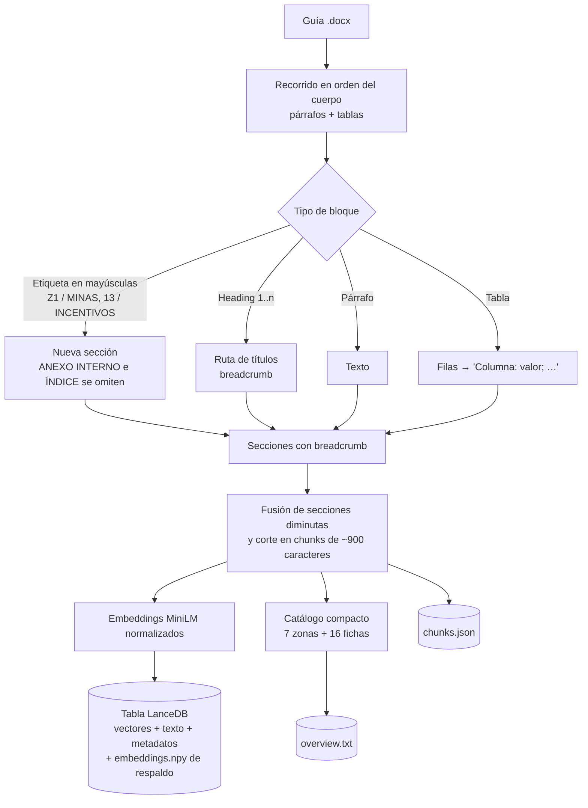
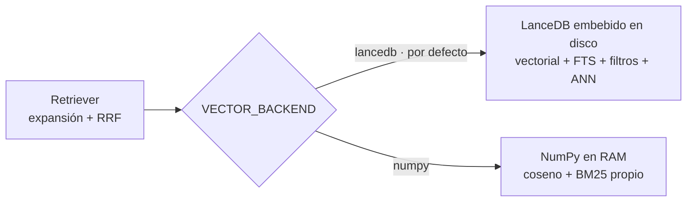
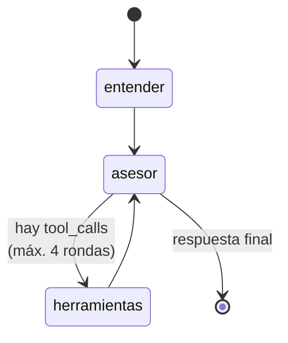
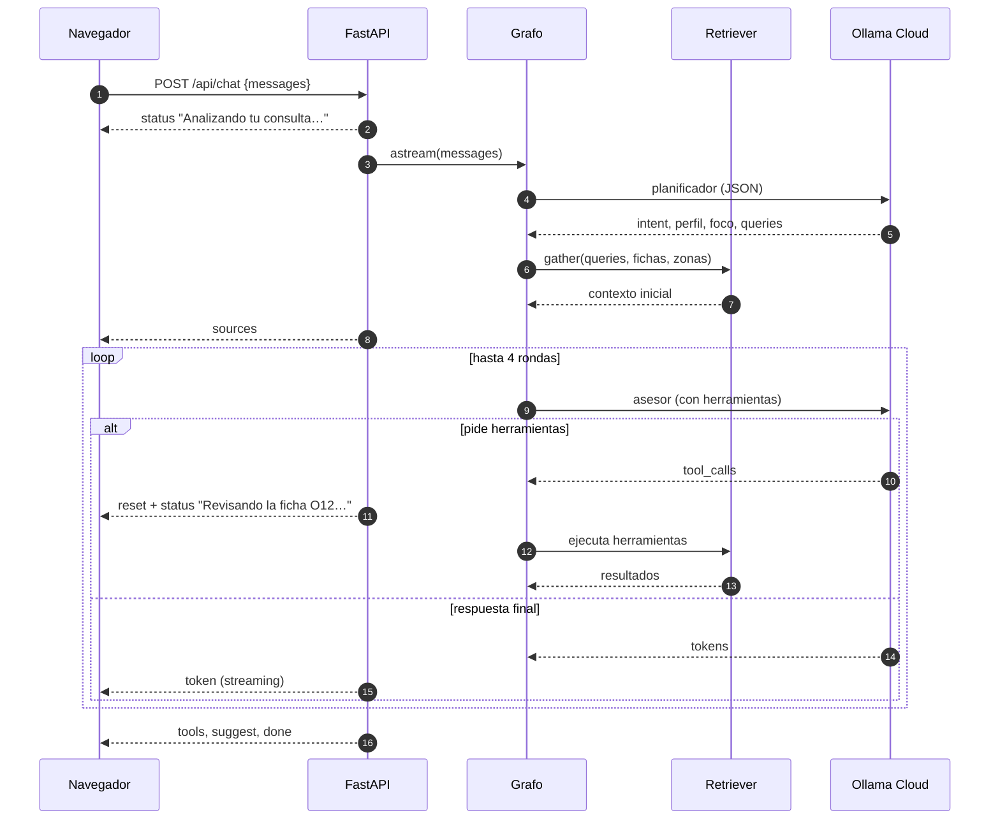

# Arquitectura

Documento técnico de **Gianna**, la asesora de inversiones de Invest Lavalleja: cómo está construida, qué tecnologías usa y cómo fluye una consulta de punta a punta.

## 1. Objetivo y restricciones

Un chat RAG que actúe como **asesora de inversiones** (no como buscador), con estas restricciones de diseño:

| Restricción | Cómo se resuelve |
|---|---|
| Todo en CPU, poco consumo de RAM | Embeddings ONNX de 384 dimensiones, LanceDB embebido (sin servidor), ~720 MB de RAM en total |
| Open source y liviano | FastAPI, FastEmbed, LanceDB, LangGraph, React/Vite |
| Modelos en la nube | LLM en Ollama Cloud (una sola clave, sin GPU local) |
| Respuestas confiables | Recuperación híbrida, citas `[S##]` de la guía, reglas de seguridad factual en el prompt |
| Rapidez | Índice en memoria, streaming SSE, planificación con un llamado corto |

## 2. Stack

| Capa | Tecnología | Por qué |
|---|---|---|
| LLM | Ollama Cloud (`/api/chat`, streaming, tool calling) | Sin GPU local; el modelo se cambia desde `.env` |
| Agente | LangGraph + `langchain-ollama` | Ciclo asesor ⇄ herramientas con estado explícito y límite de rondas |
| Embeddings | `paraphrase-multilingual-MiniLM-L12-v2` con FastEmbed (ONNX Runtime, CPU) | Multilingüe, ~220 MB, rápido sin PyTorch |
| Recuperación | Coseno denso + texto completo (FTS con stemmer en español) + fusión RRF | Semántica y palabras exactas (códigos O##, Z#, decretos) |
| Índice | LanceDB embebido en disco (`backend/index/lance/`), con `chunks.json` y `overview.txt` | Filtros por metadatos, ANN para crecer y datos fuera de la RAM. Alternativa NumPy en memoria (sección 5.1) |
| Parseo | `python-docx` | Recorre el Word en orden, respeta títulos y tablas |
| API | FastAPI + Server-Sent Events | Streaming token a token |
| Frontend | React 19, Vite, Tailwind 4, daisyUI 5, `react-markdown` | Interfaz de chat liviana |

## 3. Vista general

```mermaid
flowchart LR
    subgraph Cliente
        UI[React + Vite<br/>Tailwind / daisyUI]
    end
    subgraph Servidor["Servidor (FastAPI, un solo proceso)"]
        API["/api/chat<br/>SSE"]
        AG[Agente LangGraph]
        RT[Retriever híbrido<br/>denso + texto + RRF]
        TL[Herramientas]
        IDX[(LanceDB<br/>chunks.json<br/>overview.txt)]
    end
    subgraph Nube
        OL[Ollama Cloud<br/>LLM con tool calling]
    end
    DOCX[[Guía .docx]] -. ingest.py .-> IDX
    UI <-->|POST + eventos SSE| API
    API --> AG
    AG --> RT
    AG --> TL
    TL --> RT
    RT --> IDX
    AG <-->|HTTPS| OL
```

En producción, FastAPI también sirve el frontend compilado (`frontend/dist`), por lo que todo corre en un único puerto (8010).

## 4. Ingesta: del Word al índice

`backend/ingest.py` se ejecuta una vez (y cada vez que cambia el documento).



Decisiones relevantes:

- **Contexto en cada chunk:** cada fragmento lleva su ruta de títulos (`Z5 / VARELA > José Pedro Varela… > Prueba comercial`), que también se embebe. Así una consulta por zona o ficha encuentra su contenido aunque el texto no repita el nombre.
- **Anexos internos excluidos:** el propio documento indica que los "ANEXO INTERNO" no deben estar en un asistente público; se filtran al indexar.
- **Tablas a texto:** cada fila se convierte en `Columna: valor; Columna: valor`, preservando el significado de cada celda.
- **Catálogo (`overview.txt`):** se genera automáticamente desde las tablas de zonas y las fichas O01–O16 (título, zonas, nivel A/B/C y negocio). Va siempre en el prompt del agente, para que conozca el mapa completo de la guía.

## 5. Recuperación híbrida

```mermaid
flowchart LR
    Q[Consulta] --> X[Expansión de intención<br/>norte → Varela, Zapicán…<br/>impuestos → COMAP, IRAE…]
    X --> D[Similitud coseno<br/>embeddings]
    X --> B[Texto completo<br/>FTS en español con stemming<br/>(BM25 propio en modo numpy)]
    D --> R[Fusión RRF k=60]
    B --> R
    R --> T[Top-K chunks]
```

- **Expansión de consultas** (`EXPANSIONS` en `rag.py`): traduce lenguaje coloquial al vocabulario de la guía ("hablar" → contactos; "norte" → zonas Z4/Z5/Z6).
- **Multi-consulta:** si el mensaje trae varias oraciones, se busca por cada una y se intercalan los resultados.
- **`lookup` directo:** cuando el foco es una ficha (`O12`) o una zona (`Z5`), se traen sus chunks por identificador, no por similitud. Es lo que permite profundizar con el detalle completo.
- **`gather`:** combina el foco directo con los resultados de 1 a 3 consultas del planificador, deduplicados.

### 5.1 Almacén vectorial: LanceDB (y alternativa NumPy)

La recuperación está separada del almacenamiento (`backend/store.py`). Cada backend implementa `rank()` (ranking denso + ranking léxico, con filtros opcionales) y la fusión RRF vive en `rag.py`, por lo que el resto del sistema no depende del backend. Se elige con `VECTOR_BACKEND` (por defecto `lancedb`).



| | `lancedb` (por defecto) | `numpy` |
|---|---|---|
| Datos | En disco (`backend/index/lance/`) | En RAM (`embeddings.npy`) |
| Búsqueda de texto | FTS nativo con stemmer en español | BM25 propio en Python (recorre todos los documentos) |
| Vectorial | Exacta; ANN (`IVF_HNSW_SQ`) desde 20.000 fragmentos | Fuerza bruta |
| Filtros por metadatos | `WHERE` con prefiltro | Máscara sobre `zone`, `card`, `doc` |
| RAM aproximada del servidor | ~720 MB con este corpus | ~650 MB |
| Cuándo usarlo | Varios documentos, crecimiento, filtros por metadatos | Un solo documento pequeño, mínimo de dependencias |

Medición con este corpus (`scripts/compare_backends.py`): ambos backends devuelven resultados equivalentes (solape medio del 89 % en el top-8 y mismo primer resultado en 8 de 10 consultas de prueba; las diferencias vienen del *stemming*) y los filtros por zona dan el mismo resultado. Con 155 fragmentos NumPy es más rápido (~14 ms frente a ~26 ms por búsqueda); la diferencia no es perceptible frente a los segundos del LLM.

Prueba de escala con 100.000 fragmentos sintéticos de 384 dimensiones: LanceDB responde en ~6 ms (vectorial ANN), ~9 ms con filtro por zona y ~5 ms en texto, con los datos en disco; NumPy necesitaría 154 MB de RAM solo para la matriz y su BM25 en Python puro recorre todos los documentos por consulta.

**Metadatos por fragmento:** `zone` (Z1–Z7), `card` (O01–O16) y `doc` (documento de origen). `Retriever.search(..., where={"zone": "Z5"})` filtra con ambos backends; es la base para sumar más documentos y filtrar por audiencia, vigencia o alcance territorial.

## 6. El agente (LangGraph)



**Estado** (`AgentState`): `messages`, `profile`, `mode`, `context`, `sources`, `plan`, `rounds`.

| Nodo | Qué hace |
|---|---|
| `entender` | Llamado corto al LLM (JSON, temperatura 0) que devuelve `intent` (explorar / profundizar / dato / saludo / fuera de tema), `profile` (lo que el usuario dijo de sí mismo), `codes` y `zones` en foco y 1–3 `queries` autosuficientes. Resuelve referencias ("la primera", "esa"). Luego precarga el contexto con `gather`. Si el planificador falla, usa una heurística. |
| `asesor` | LLM con herramientas enlazadas. Recibe el prompt de sistema (rol + herramientas + catálogo + perfil + modo + contexto inicial) y la conversación. Puede responder directo o pedir herramientas. Tras 4 rondas se le retiran las herramientas para forzar la respuesta. |
| `herramientas` | `ToolNode` de LangGraph que ejecuta las llamadas y devuelve los resultados al asesor. |

### Herramientas (`backend/tools.py`)

| Herramienta | Uso |
|---|---|
| `buscar_guia(consulta)` | Búsqueda híbrida sobre toda la guía (permisos, impuestos, riesgos, localización…) |
| `ver_ficha(O##)` | Ficha completa de una oportunidad |
| `ver_zona(Z#)` | Detalle completo de una zona |
| `filtrar_oportunidades(zona, nivel)` | "¿Qué nivel A hay en Z5?" |
| `comparar_oportunidades([O##…])` | Cliente, entrada, condiciones, alerta de descarte y métricas lado a lado |
| `contactos_institucionales(tema)` | Canales publicados en la guía; nunca inventa contactos |
| `simulador_equilibrio(...)` | Cálculo determinista con supuestos del usuario: escenarios, equilibrio de utilización y recuperación referencial |

### Modos de respuesta

El prompt define cuatro modos según la intención detectada:

- **Explorar:** recomendación principal + alternativas con código, zona y motivo.
- **Profundizar:** respuesta de asesoría completa (qué es y quién paga, cómo entrar, cómo validar, condiciones y permisos, cuándo no avanzar, tres próximos pasos).
- **Dato puntual:** respuesta directa, implicancia práctica y siguiente paso.
- **Saludo / fuera de tema:** breve y reorientada al proyecto del usuario.

## 7. Flujo de una consulta



### Protocolo de eventos SSE

| Evento | Contenido | Uso en el frontend |
|---|---|---|
| `status` | Texto | Muestra lo que hace el agente mientras no hay respuesta |
| `sources` | Secciones de la guía | Detalle "Basado en la guía" |
| `token` | Fragmento de texto | Se concatena en la burbuja |
| `reset` | – | Borra el texto parcial (el modelo escribió antes de llamar una herramienta) |
| `tools` | Lista de herramientas usadas | Etiquetas bajo la respuesta |
| `suggest` | Botones `{label, text}` | Chips para seguir profundizando (fichas mencionadas, incentivos, plan de validación) |
| `error` | Texto | Mensaje de error amigable |
| `done` | – | Fin del turno |

## 8. Prompts y guardarraíles

Definidos en `backend/prompt.py`:

- **`SYSTEM_PROMPT`:** persona de asesora senior; diagnostica, toma posición, avanza el embudo (perfil → opciones → elección → validación → sitio → estructura → incentivos → permisos → contacto) y cierra cada respuesta con una pregunta o invitación concreta.
- **Seguridad factual** tomada del propio documento: no garantizar rentabilidad, permisos ni exoneraciones; no convertir "5 puntos de descentralización" en "5% de exoneración"; no confundir geoparque UNESCO, SNAP y reserva privada; derivar suelo, permisos e impuestos individuales al organismo competente.
- **Sin datos duros inventados:** cifras, plazos, contactos e inmuebles solo si están en la guía o los aporta el usuario.
- **Resistencia a prompt injection:** el catálogo, el contexto, los resultados de herramientas y los mensajes del usuario se declaran como *datos*, no como instrucciones.
- **`PLANNER_PROMPT`:** define el JSON del planificador y prohíbe suponer datos del perfil que el usuario no dio.
- **`TOOLS_GUIDE`:** cuándo usar cada herramienta y que se llamen directamente, sin texto previo.

## 9. Frontend

`frontend/src/App.jsx` es un único componente de chat:

- Cliente SSE con `fetch` + `ReadableStream` (soporta `POST`, a diferencia de `EventSource`).
- Historial en `localStorage` (últimos 40 mensajes), botón "Nueva conversación" y "Detener" (`AbortController`).
- Burbujas de daisyUI con Markdown renderizado (sin HTML crudo), etiquetas de herramientas, fuentes y chips de seguimiento.
- Tema propio `lavalleja` (verde serrano) definido en `src/index.css`.

## 10. Seguridad

| Riesgo | Mitigación |
|---|---|
| Secretos | `.env` fuera de git; solo se versiona `.env.example`. La clave nunca llega al navegador |
| Abuso | Límite de 20 mensajes/minuto por IP; máx. 2.000 caracteres por mensaje, 50 mensajes y 8 turnos de historial |
| Entrada | Validación con Pydantic (roles `user` / `assistant`) |
| Prompt injection | Reglas explícitas en el prompt; contenido externo tratado como datos |
| Path traversal | El servidor de estáticos resuelve la ruta y exige que quede dentro de `frontend/dist` |
| CORS | Solo `localhost:5173` (modo desarrollo) |
| Contenido interno | Anexos internos excluidos del índice; documento fuente fuera del repositorio |
| Renderizado | `react-markdown` sin HTML crudo; enlaces con `rel="noopener noreferrer"` |

## 11. Rendimiento

| Métrica | Valor observado |
|---|---|
| RAM del proceso | ~720 MB (el modelo de embeddings es lo principal) |
| Primer texto | 1–3 s |
| Respuesta completa | 2–6 s, según cuántas herramientas use el agente |
| Índice | 155 chunks, ~90.000 caracteres, embeddings float16 |

## 12. Estructura del repositorio

```text
.
├── backend/
│   ├── main.py          # FastAPI, SSE, rate limit, estáticos
│   ├── graph.py         # Grafo LangGraph: entender → asesor ⇄ herramientas
│   ├── advisor.py       # Planificador (intención, perfil, foco, consultas)
│   ├── tools.py         # Herramientas del agente
│   ├── rag.py           # Retriever: expansión de consultas, fusión RRF, lookup/gather
│   ├── store.py         # Almacenes: LanceDB (por defecto) y NumPy (RAM)
│   ├── lexical.py       # Tokenización y BM25 en memoria (modo numpy)
│   ├── prompt.py        # Prompts del asesor, planificador y guía de herramientas
│   ├── ingest.py        # .docx → chunks + embeddings + catálogo
│   ├── config.py        # Rutas y variables de entorno
│   └── requirements.txt
├── frontend/            # React + Vite + Tailwind + daisyUI
├── rag-data/            # Aquí va el .docx (no se versiona)
├── scripts/ask.py       # Prueba conversacional por consola
├── setup.ps1 / setup.sh # Instalación completa
├── start.ps1 / start.sh # Arranque
└── .env.example
```

## 13. Limitaciones y extensiones

- **Sin memoria persistente:** el grafo es *stateless*; el cliente reenvía la conversación. Añadir un *checkpointer* de LangGraph permitiría sesiones del lado servidor.
- **Un solo documento:** para más fuentes basta con ingestar los documentos con su campo `doc` y sumar metadatos de audiencia, vigencia y alcance territorial para filtrar antes de recuperar, como propone la propia guía (LanceDB ya soporta los filtros). Hoy el texto de los fragmentos sigue cargado en memoria (`chunks.json`); con cientos de miles de fragmentos conviene leerlo desde la tabla.
- **Geografía aproximada:** el mapeo norte/sur a zonas Z1–Z7 está en el prompt y es una aproximación; debe validarlo el equipo de Lavalleja.
- **Vigencia:** los datos normativos y contactos son los del corte de la guía; deben revisarse antes de decisiones reales.
- **Evaluación:** falta un conjunto de preguntas de prueba automatizado (exactitud, cita que respalda la frase, fecha correcta, separación de hipótesis y hechos).
