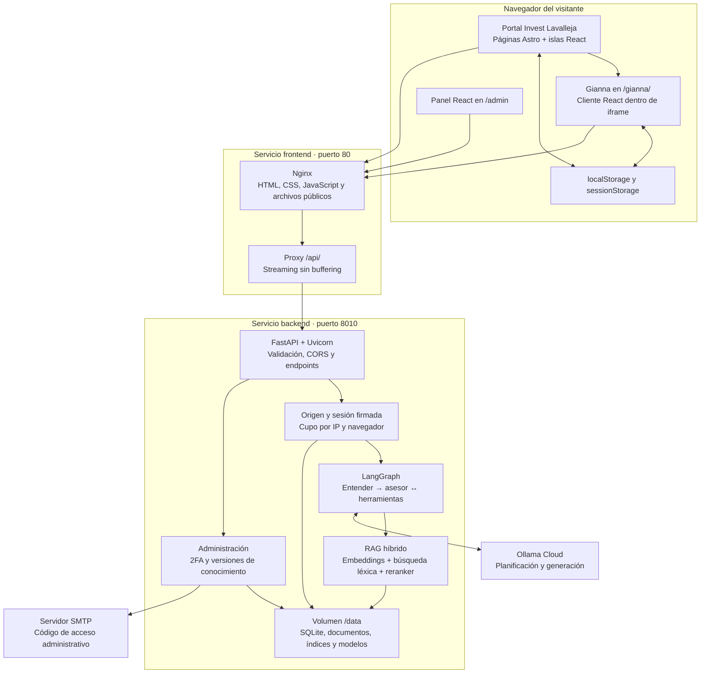
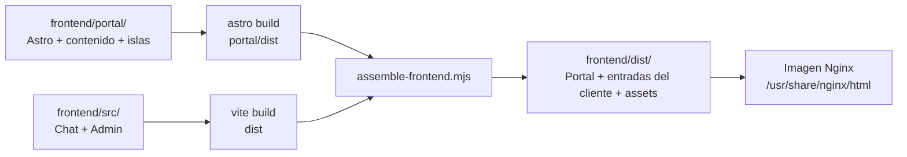
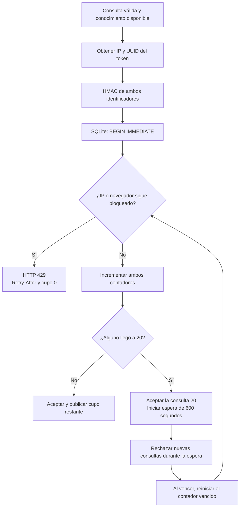
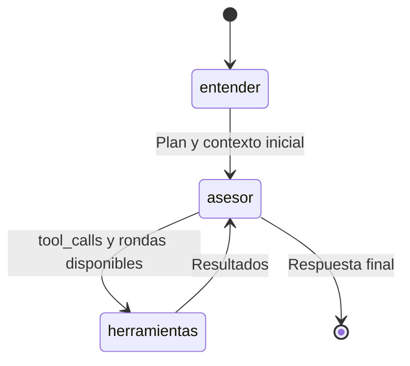
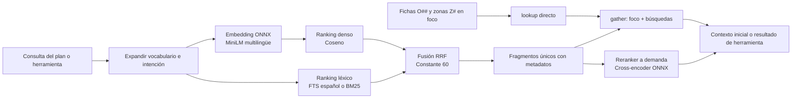
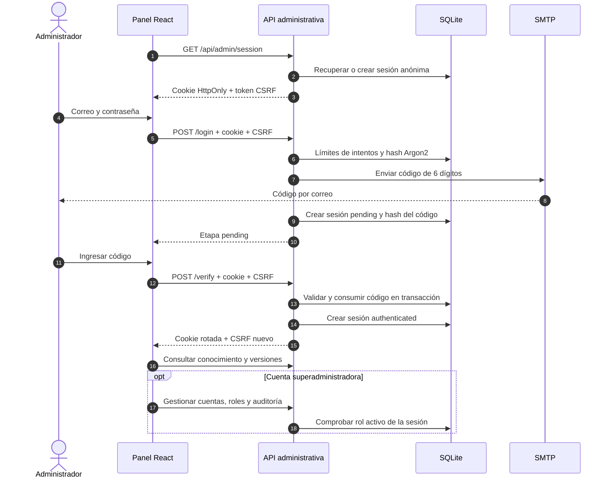
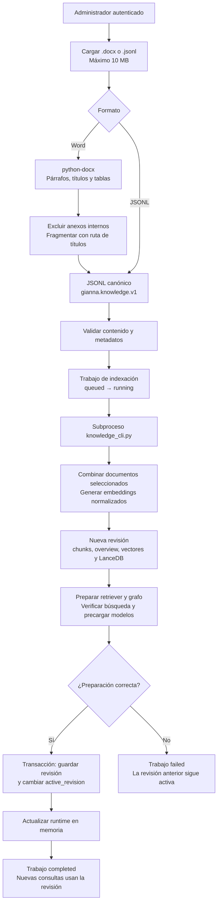
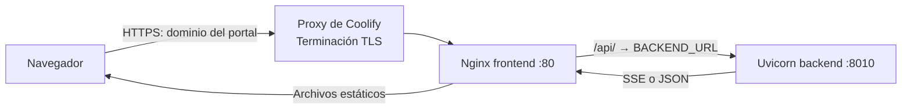

# Arquitectura y flujos de Invest Lavalleja + Gianna

Actualizado: **1 de octubre de 2026**. Describe la implementación actual del repositorio.

El sistema combina el portal editorial de Invest Lavalleja, el agente de inversiones Gianna y un panel administrativo. Se despliega en **dos servicios independientes**: un frontend estático servido por Nginx y una API Python servida por Uvicorn.

## Índice

1. [Vista general](#1-vista-general)
2. [Tecnologías utilizadas](#2-tecnologías-utilizadas)
3. [Organización y responsabilidades](#3-organización-y-responsabilidades)
4. [Frontend: compilación y navegación](#4-frontend-compilación-y-navegación)
5. [Frontend: funcionamiento del chat](#5-frontend-funcionamiento-del-chat)
6. [Flujo completo de una consulta](#6-flujo-completo-de-una-consulta)
7. [Sesión del navegador y límite de consultas](#7-sesión-del-navegador-y-límite-de-consultas)
8. [Backend: agente y recuperación de conocimiento](#8-backend-agente-y-recuperación-de-conocimiento)
9. [Administración y acceso con dos pasos](#9-administración-y-acceso-con-dos-pasos)
10. [Carga, indexación y activación de documentos](#10-carga-indexación-y-activación-de-documentos)
11. [Datos, persistencia y privacidad](#11-datos-persistencia-y-privacidad)
12. [Contenedores y conexión entre servicios](#12-contenedores-y-conexión-entre-servicios)
13. [Configuración por entorno](#13-configuración-por-entorno)
14. [Arranque, errores y límites operativos](#14-arranque-errores-y-límites-operativos)
15. [Validación y documentos relacionados](#15-validación-y-documentos-relacionados)

## 1. Vista general



El diagrama representa la conexión mediante proxy del mismo origen. También existe una conexión directa del navegador a la API mediante CORS, detallada en la sección 12.

### Responsabilidad de cada parte

| Parte | Responsabilidad |
|---|---|
| Portal | Presentar páginas, sectores, zonas, recursos, mapas, fuentes y herramientas para preparar un proyecto |
| Cliente Gianna | Gestionar la conversación local, enviar el contexto, representar el streaming y mostrar el cupo |
| Panel administrativo | Acceso en dos pasos, gestión de documentos, versiones, usuarios y auditoría |
| Nginx | Servir los archivos del frontend, controlar la entrada al iframe y reenviar la API en modo proxy |
| FastAPI | Validar solicitudes, comprobar acceso y cupos, exponer SSE y gestionar la administración |
| LangGraph | Coordinar planificación, recuperación inicial, generación y llamadas a herramientas |
| RAG | Buscar fragmentos de los documentos activados y aportar contexto al modelo |
| Ollama Cloud | Interpretar la consulta y generar la respuesta con el modelo configurado |
| Almacenamiento del backend | Conservar conocimiento, cuentas, sesiones administrativas y contadores de uso |

## 2. Tecnologías utilizadas

Las versiones siguientes proceden de los archivos de bloqueo actuales; los rangos de `package.json` y `requirements.txt` pueden ser más amplios.

### 2.1 Frontend

| Tecnología | Versión bloqueada | Uso |
|---|---|---|
| Astro | 7.3.3 | Generación estática del portal, rutas, layouts y navegación con ClientRouter |
| React / React DOM | 19.3.0 | Islas interactivas del portal, chat y panel administrativo |
| Vite | 8.3.1 en el cliente; 8.3.0 en el portal | Desarrollo y compilación de los dos paquetes |
| TypeScript | 5.9.3 en el portal | Tipos de datos, componentes e interacciones del portal |
| JavaScript con JSX | Código del cliente | Aplicaciones existentes de Gianna y administración |
| Tailwind CSS | 4.3.3 | Estilos del portal y del cliente |
| daisyUI | 5.7.47 | Componentes visuales del chat y del panel |
| react-markdown | 10.1.0 | Representación de respuestas Markdown sin habilitar HTML crudo |
| Nanostores | 1.5.3 | Estado compartido del dossier, proyecto y preferencia de movimiento del portal |
| @nanostores/react | 1.1.0 | Suscripción de las islas React al estado del portal |
| Fuse.js | 7.5.0 | Búsqueda del contenido editorial en el navegador |
| Zod | 4.6.5 | Validación de los datos del portal guardados en el navegador |
| @astrojs/react / sitemap | Integraciones del portal | Hidratación React y sitemap cuando se configura el dominio público |
| Fetch, ReadableStream, AbortController | APIs del navegador | Solicitudes HTTP, lectura SSE y cancelación del chat |
| localStorage / sessionStorage | APIs del navegador | Persistencia local del chat y de las herramientas del portal |

El portal y el cliente tienen **sus propios `package.json` y `package-lock.json`**. El portal usa Nanostores; el chat utiliza hooks de React y almacenamiento local directamente.

### 2.2 Backend

| Tecnología | Versión bloqueada | Uso |
|---|---|---|
| Python | 3.14 en Docker | Runtime del backend |
| FastAPI | 0.142.2 | API HTTP, dependencias web y CORS |
| Uvicorn | 0.54.0 | Servidor ASGI, un worker y confianza configurada en proxies |
| Pydantic | 2.13.5 | Validación de mensajes, sesiones y datos administrativos |
| LangGraph | 1.2.12 | Grafo del agente y ejecución de herramientas |
| langchain-core | 1.6.6 | Mensajes, herramientas y fragmentos de streaming |
| langchain-ollama | 1.1.0 | Integración ChatOllama con generación y tool calling |
| HTTPX | 0.28.1 | Cliente HTTP asíncrono del planificador |
| FastEmbed | 0.8.1 | Embeddings y cross-encoder en CPU |
| ONNX Runtime | 1.30.0 | Ejecución local de los modelos de recuperación |
| LanceDB | 0.39.0 | Índice vectorial embebido y búsqueda de texto completo |
| NumPy | 2.5.3 | Vectores, normalización, respaldo y alternativa de búsqueda en memoria |
| python-docx | 1.2.0 | Lectura y extracción de documentos Word |
| Argon2 / argon2-cffi | 25.1.0 | Hash de contraseñas administrativas |
| python-multipart | 0.0.32 | Carga de documentos mediante formularios |
| python-dotenv | 1.2.3 | Carga de `backend/.env` |
| SQLite, HMAC-SHA256, smtplib, ssl, asyncio | Biblioteca estándar de Python | Persistencia, firmas, correo, TLS, concurrencia y trabajos de indexación |

### 2.3 Modelos

| Función | Modelo o configuración |
|---|---|
| Planificador y asesor | Modelo indicado en `OLLAMA_MODEL`, servido desde `OLLAMA_HOST`; credencial `OLLAMA_API_KEY` |
| Embeddings | `sentence-transformers/paraphrase-multilingual-MiniLM-L12-v2`, vectores de 384 dimensiones |
| Reranker | `cross-encoder/mmarco-mMiniLMv2-L12-H384-v1` |
| Archivo ONNX del reranker | `onnx/model_quint8_avx2.onnx`, variante cuantizada para CPU con AVX2 |
| Backend vectorial predeterminado | `VECTOR_BACKEND=lancedb`; alternativa `numpy` |

El modelo generativo corre en Ollama Cloud. Los embeddings y el reranker se ejecutan en el backend con CPU.

### 2.4 Infraestructura y herramientas de calidad

| Tecnología | Función |
|---|---|
| Node.js 24 Alpine | Compilación de la imagen frontend |
| Nginx 1.28 Alpine | Servicio estático y proxy del frontend en producción |
| Python 3.14 slim Bookworm | Imagen de ejecución del backend |
| Docker / Docker Compose | Construcción y ejecución independiente de los servicios; composición local |
| Coolify | Destino previsto de despliegue como dos aplicaciones Dockerfile |
| pytest | Pruebas de API, seguridad, cupos, conocimiento y runtime del backend |
| Vitest 4.1.11 | Pruebas unitarias del portal |
| Playwright 1.63.0 / axe-core | Flujos de navegador y comprobaciones de accesibilidad |
| Astro check / ESLint 9.39.5 | Comprobaciones de tipos y código del portal |
| GitHub Actions | Flujo CI de compilación, comprobaciones y pruebas |

## 3. Organización y responsabilidades

```text
chat-invest/
├── frontend/
│   ├── portal/                  Portal original: Astro, React y TypeScript
│   │   ├── src/pages/           Rutas estáticas y página /gianna/
│   │   ├── src/layouts/         Estructura compartida del sitio
│   │   ├── src/components/      Contenido editorial e islas interactivas
│   │   ├── src/data/            Páginas, catálogo y manifiesto de rutas
│   │   ├── src/stores/          Nanostores y persistencia del portal
│   │   └── public/              Medios, mapas, documentos y recursos
│   ├── src/
│   │   ├── main.jsx            Selección de chat o panel
│   │   ├── App.jsx             Interfaz, historial y streaming del chat
│   │   ├── Admin.jsx           Panel administrativo
│   │   ├── api.js              Resolución de la URL pública de la API
│   │   └── chat-session.js     Identidad, token y solicitudes del chat
│   ├── scripts/                Ensamblado del portal y cliente compilados
│   ├── nginx/                  Proxy, rutas, acceso al iframe y variables
│   ├── Dockerfile              Build Node → runtime Nginx
│   └── compose.yaml            Configuración autónoma del frontend
├── backend/
│   ├── main.py                 API, arranque, runtime y streaming SSE
│   ├── asgi.py                 Arranque local con Uvicorn
│   ├── manage.py               Migraciones, datos base y cuentas por consola
│   ├── db_migrations.py        Aplicación transaccional de migraciones SQLite
│   ├── migrations/             Esquemas SQL versionados de administración y cupos
│   ├── chat_access.py          Origen, sesión firmada y cupos
│   ├── graph.py                Grafo entender → asesor ↔ herramientas
│   ├── advisor.py              Planificador y alternativa heurística
│   ├── prompt.py               Rol, modos y reglas del agente
│   ├── tools.py                Herramientas de inversión y recuperación
│   ├── rag.py                  Recuperación híbrida y reranking
│   ├── store.py / lexical.py   Almacenes vectoriales y búsqueda léxica
│   ├── ingest.py               Word → secciones y fragmentos
│   ├── knowledge_format.py     Validación del formato JSONL
│   ├── knowledge_cli.py        Exportación y construcción del índice
│   ├── knowledge_admin.py      Documentos, trabajos y versiones activas
│   ├── admin_api.py            Endpoints del panel
│   ├── admin_auth.py           Contraseñas, correo, sesiones, 2FA y CSRF
│   ├── admin_db.py             Esquema SQLite administrativo
│   ├── admin_runtime.py        Exclusión de múltiples escritores
│   ├── scripts/ / tests/       Diagnóstico y validación
│   ├── docker/                 Entrypoint del contenedor
│   ├── Dockerfile              Runtime Python + Uvicorn
│   └── compose.yaml            Configuración autónoma del backend
├── compose.yaml                Incluye los dos servicios
├── compose.local.yaml          Puertos y ajustes para HTTP local
└── .github/workflows/ci.yml    Integración continua
```

Los directorios locales de datos y los archivos `.env` se excluyen del repositorio y del contexto de las imágenes según sus reglas de ignorado. `sample-backend/` es una referencia y queda fuera de los servicios de la aplicación.

## 4. Frontend: compilación y navegación

### 4.1 Construcción de los archivos que sirve Nginx



El comando `npm run build` ejecuta, en orden:

1. La compilación del portal con Astro.
2. La compilación del chat y del panel con Vite.
3. El ensamblado: copia la entrada del cliente a `/_gianna/index.html` y `/admin/index.html`, y reúne el resultado Astro con los assets del cliente.

Node.js se utiliza en la etapa de compilación. La imagen final ejecuta Nginx.

### 4.2 Rutas y aplicaciones

| Ruta | Qué entrega | Comportamiento |
|---|---|---|
| `/` y rutas editoriales | HTML generado por Astro | Navegación del portal y contenido público |
| `/gianna/` | Página Astro con cabecera, introducción, alcance y pie | Carga el chat mediante un iframe del mismo origen |
| `/_gianna/` | Entrada Vite del chat | Nginx exige contexto de iframe y referencia a `/gianna/`; React comprueba el padre |
| `/admin/login` | Entrada Vite de acceso al panel | Contraseña y código por correo; `/admin` redirige aquí |
| `/admin/` | Entrada Vite del panel | Sesión autenticada; la API verifica permisos |
| Otras rutas `/admin/*` | Página 404 | No se usa un fallback general del panel |
| `/chat` y `/chat/` | Redirección 302 | Lleva a `/gianna/` |
| `/api/` | Proxy al backend | Se usa cuando `VITE_API_URL` está vacío |
| `/health` | Respuesta de Nginx | Salud del servicio frontend |
| `/assets/` y `/_astro/` | Recursos compilados | Caché prolongada |
| Rutas desconocidas | Página 404 del portal | Respuesta HTTP 404 |

### 4.3 Flujo del portal

Astro genera el contenido editorial a partir de `route-manifest.json`, `pages.json` y `catalog.json`. `SiteLayout.astro` aporta metadatos, cabecera, pie, accesibilidad y `ClientRouter`.

Las islas React se activan para las funciones interactivas:

| Función | Proceso | Datos |
|---|---|---|
| Buscador global | Fuse.js consulta el índice editorial local y navega al resultado | Contenido incluido en el build |
| Explorador y mapas | Consulta el catálogo y los recursos publicados | Archivos del portal |
| Dossier | Selecciona hasta tres zonas; permite descarga Markdown e impresión | Nanostores + localStorage |
| Proyecto | Recoge actividad, etapa y necesidades; genera un resumen descargable | Nanostores + sessionStorage |
| Preferencia de movimiento | Actualiza la interfaz y conserva la elección | Nanostores + localStorage |

La navegación editorial permanece disponible sin JavaScript; las herramientas interactivas y el chat necesitan JavaScript.

**El contenido del portal y la base RAG son dos fuentes distintas.** Actualizar documentos en el panel modifica el conocimiento de Gianna. Para actualizar páginas, catálogo o recursos editoriales se modifica y recompila el portal.

## 5. Frontend: funcionamiento del chat

1. La persona abre `/gianna/` y la página carga `/_gianna/?theme=invest`.
2. Nginx valida los encabezados de navegación del iframe. `main.jsx` comprueba que el padre sea del mismo origen y esté en `/gianna/`.
3. `App.jsx` recupera los últimos 40 mensajes válidos de `gianna-chat-v1`.
4. `chat-session.js` recupera o crea el UUID `gianna-browser-v1` y solicita una sesión firmada.
5. La interfaz consulta el cupo, habilita el envío y mantiene el contador actualizado cada 30 segundos, al recuperar el foco y mediante eventos de almacenamiento.
6. Al enviar, añade el mensaje y solicita `POST /api/chat` con el token en `X-Chat-Session`.
7. `fetch` y `ReadableStream` leen la respuesta SSE; React actualiza texto, estado, fuentes, herramientas y sugerencias.
8. El historial se guarda en el navegador. La cuenta regresiva se actualiza cada segundo y vuelve a consultar a la API cuando termina.

### Interacciones del usuario

| Acción | Efecto |
|---|---|
| Enviar | Acepta hasta 2.000 caracteres; envía roles y contenido, excluyendo mensajes de error |
| Elegir una sugerencia | Envía un nuevo mensaje por el mismo flujo |
| Detener | AbortController cancela la solicitud; si fue aceptada ya consumió cupo |
| Nueva conversación | Vacía el historial; conserva la identidad y el cupo |
| Recargar | Recupera el historial local y solicita una nueva sesión del chat |
| Recibir 401 por sesión | El cliente renueva el token una vez y reintenta |
| Recibir 429 | Sincroniza la espera devuelta por el backend y bloquea los envíos |
| Almacenamiento deshabilitado | Continúa con estado en memoria; el límite por IP sigue vigente |

El token del chat permanece en memoria del módulo. La identidad del navegador persiste en localStorage y se comparte entre pestañas del mismo origen.

## 6. Flujo completo de una consulta

```mermaid
sequenceDiagram
    autonumber
    actor U as Visitante
    participant UI as React Gianna
    participant N as Nginx
    participant API as FastAPI
    participant Q as Acceso y SQLite de cupos
    participant G as LangGraph
    participant R as Recuperación y herramientas
    participant L as Ollama Cloud

    U->>UI: Escribir consulta
    UI->>N: POST /api/chat + messages + X-Chat-Session
    N->>API: Reenvío sin buffering + IP validada
    API->>Q: Validar Origin, firma y vencimiento
    API->>API: Comprobar conocimiento y mensaje
    API->>Q: Consumir por IP y UUID en transacción
    alt Algún identificador está en espera
        Q-->>API: Bloqueado + segundos restantes
        API-->>UI: HTTP 429 + Retry-After
        UI-->>U: Cuenta regresiva
    else Consulta aceptada
        API-->>UI: HTTP 200 SSE + encabezados de cupo
        API-->>UI: status
        API->>G: Ejecutar con los últimos 8 mensajes
        G->>L: Planificar intención, perfil y búsquedas
        L-->>G: Plan JSON
        G->>R: gather de consultas, fichas y zonas
        R-->>G: Contexto, fuentes y confianza
        API-->>UI: sources + status
        loop Iteraciones con herramientas, hasta 4
            G->>L: Asesor con contexto y herramientas
            alt El modelo solicita herramientas
                L-->>G: tool_calls
                API-->>UI: reset + status
                G->>R: Ejecutar herramientas
                R-->>G: Resultados
            else El modelo responde
                L-->>G: Fragmentos de texto
                API-->>UI: token
            end
        end
        Note over G,L: Si alcanza el límite, la siguiente invocación no ofrece herramientas
        API-->>UI: tools y suggest cuando corresponde; done
        UI->>UI: Persistir historial en localStorage
        UI-->>U: Respuesta, fuentes y próximos pasos
    end
```

La conexión directa por CORS utiliza el mismo contrato de la API y omite el salto por Nginx para las solicitudes al backend.

### 6.1 Endpoints públicos del agente

| Método y ruta | Entrada | Salida |
|---|---|---|
| `GET /api/health` | — | `ok`, modelo, cantidad de fragmentos y `knowledge_ready` |
| `POST /api/chat/session` | `{browser_id: UUID}` y Origin permitido | Token firmado, límite, consultas restantes y segundos de espera |
| `POST /api/chat/quota` | Origin y `X-Chat-Session` | Cupo autoritativo; no consume una consulta |
| `POST /api/chat` | `{messages: [{role, content}]}`, Origin y token | Streaming SSE o error HTTP |

La API admite de 1 a 50 mensajes con roles `user` o `assistant` y un máximo de 6.000 caracteres por elemento. Para generar toma los **últimos 8 mensajes**; el último debe ser del usuario, tener contenido y no superar 2.000 caracteres.

### 6.2 Eventos SSE

Cada evento se transmite con `event: nombre` y `data: JSON`, separados por una línea en blanco.

| Evento | Contenido | Uso |
|---|---|---|
| `status` | Texto | Mostrar planificación, recuperación o uso de herramientas |
| `sources` | Lista de secciones del contexto inicial | Referencias de la guía |
| `token` | Fragmento de texto | Construir la respuesta progresivamente |
| `reset` | Cadena vacía | Descartar texto parcial anterior a una llamada de herramienta |
| `tools` | Lista de etiquetas | Mostrar las herramientas utilizadas, sin argumentos |
| `suggest` | Lista de `{label, text}` | Acciones para continuar la conversación |
| `error` | Texto de error | Mostrar un fallo del modelo durante el streaming |
| `done` | Cadena vacía | Finalizar el turno |

Los errores previos al streaming usan códigos HTTP. Un fallo durante la generación usa `error` seguido de `done`. Los encabezados `Cache-Control: no-store` y `X-Accel-Buffering: no`, junto con la configuración de Nginx, mantienen el streaming sin caché ni buffering del proxy.

## 7. Sesión del navegador y límite de consultas

El acceso al chat y el control de uso están implementados en [backend/chat_access.py](backend/chat_access.py).

### 7.1 Sesión firmada

- El navegador propone un UUID persistente.
- El backend emite un token con UUID, origen y vencimiento de 30 días, firmado mediante HMAC-SHA256.
- Cada consulta comprueba el Origin autorizado, la firma, el UUID y el vencimiento.
- La clave es la `ADMIN_SECRET_KEY` estable del backend.
- Esta sesión identifica un navegador para el cupo; no representa una cuenta personal autenticada.

### 7.2 Reglas del cupo



Las 20 consultas se acumulan hasta agotar el cupo; **no es una ventana de 20 consultas por minuto**. La consulta número 20 se responde y comienza la espera. El bloqueo se aplica si cualquiera de los dos identificadores sigue bloqueado.

| Situación | Resultado |
|---|---|
| Mismo navegador, otra IP | Mantiene el límite del navegador |
| Otra sesión de navegador, misma IP | Mantiene el límite de la IP |
| Varias pestañas | Comparten UUID local; el backend sigue siendo la autoridad |
| Borrar historial | Conserva el cupo |
| Reiniciar el backend | Conserva el cupo en SQLite |
| Solicitud inválida o conocimiento vacío | No consume cupo |
| Cancelar una solicitud aceptada | Consume cupo |
| Finalizar los 600 segundos | Se restablece el contador que venció |

La transacción aplica los dos contadores de forma atómica. La base almacena únicamente hashes HMAC, usos y tiempos; elimina entradas inactivas de más de 30 días.

Personas que comparten una IP pública también comparten el límite por IP. La propagación correcta de la IP depende de configurar los proxies de confianza.

## 8. Backend: agente y recuperación de conocimiento

### 8.1 Grafo LangGraph



| Nodo | Trabajo |
|---|---|
| `entender` | Usa el planificador para resolver intención, perfil, fichas, zonas y hasta tres consultas; recupera contexto inicial |
| `asesor` | Construye el prompt con rol, catálogo, perfil, modo y contexto; invoca el modelo con o sin herramientas |
| `herramientas` | ToolNode ejecuta las funciones solicitadas y añade sus resultados al estado |

El estado de la ejecución contiene `messages`, `profile`, `mode`, `context`, `sources`, `plan`, `rounds` y `low_confidence`. Cada solicitud comienza una ejecución nueva con el contexto enviado por el navegador; el grafo se compila sin checkpointer.

El planificador solicita JSON con temperatura 0 y un timeout de 12 segundos por solicitud. Si falla, una heurística toma el último mensaje, el contexto anterior y los códigos mencionados. El asesor usa temperatura 0,35 y un límite de 1.600 tokens de predicción.

Con el valor predeterminado `TOP_K=8`, el nodo inicial solicita ocho resultados adicionales a los fragmentos en foco; para profundizar aumenta ese valor en cuatro. Una similitud máxima inferior a 0,45 agrega una indicación de considerar el reranker, exceptuando saludos y consultas fuera de tema.

El prompt distingue explorar, profundizar, dato puntual, saludo y fuera de tema. Incluye reglas sobre fuentes, cifras, permisos, rentabilidad y tratamiento del contenido recuperado como datos.

### 8.2 Recuperación RAG híbrida



La expansión aproxima el lenguaje del usuario al vocabulario de la guía. `search_multi` divide consultas con varias preguntas e intercala resultados. `lookup` accede directamente a fichas y zonas. `gather` une el foco y las búsquedas sin duplicados.

| Almacén | Funcionamiento |
|---|---|
| LanceDB | Base embebida en disco; ranking vectorial y FTS español con stemming, filtros por `zone`, `card` y `doc` |
| NumPy | Vectores en memoria, coseno y BM25 implementado en `lexical.py` |
| RRF | Fusión común a ambos almacenes, implementada en `rag.py` |
| Índice ANN | LanceDB lo crea desde 20.000 fragmentos, con `IVF_HNSW_SQ`; para corpus pequeños usa búsqueda vectorial exacta |
| Caché de embeddings de consultas | LRU de hasta 256 entradas en RAM, sin persistencia en disco |

El reranker se precarga cuando se prepara una base no vacía y se utiliza si el agente llama a su herramienta. Recupera candidatos mediante `search_multi` y `search`, los deduplica y devuelve los cinco mejor puntuados. Cada búsqueda usa un parámetro de hasta 24 candidatos; la unión puede contener más de 24 candidatos distintos.

### 8.3 Herramientas del agente

| Herramienta | Proceso |
|---|---|
| `buscar_guia` | Recuperación híbrida sobre los documentos activos |
| `buscar_guia_reranker` | Recuperación ampliada y ordenamiento con cross-encoder |
| `ver_ficha` | Obtención directa del contenido de una ficha O## |
| `ver_zona` | Obtención directa del contenido de una zona Z# |
| `filtrar_oportunidades` | Filtrado del catálogo por zona y nivel |
| `comparar_oportunidades` | Comparación de fichas a partir de información de la guía |
| `contactos_institucionales` | Selección de contactos publicados en la guía |
| `simulador_equilibrio` | Cálculo determinista de escenarios con los supuestos aportados por el usuario |

Estas herramientas trabajan con el conocimiento activado y cálculos locales. El buscador editorial del portal opera sobre su propio catálogo compilado.

## 9. Administración y acceso con dos pasos

### Nombres, roles y operación por consola

Las cuentas tienen nombre, correo y rol. Un administrador gestiona conocimiento y su contraseña. Un superadministrador también gestiona usuarios, roles y auditoría. La API comprueba los permisos en cada solicitud; el panel adapta sus controles. Un cambio de rol revoca las sesiones del usuario y no se puede quitar el último superadministrador activo.

Las migraciones SQL de `backend/migrations/` se aplican transaccionalmente con `PRAGMA user_version`: administración en versión 2 y cupos en versión 1. Las cuentas preexistentes mantienen todos sus permisos como superadministradores; sus nombres iniciales se derivan del correo.

Los comandos de operación están en [backend/Instructions.txt](backend/Instructions.txt): entorno virtual, dependencias, `python -m manage db upgrade -d migrations`, `seed-data`, `create-admin nombre correo contraseña true/false` y `python asgi.py`. La migración y preparación manual requieren el servicio detenido.

El panel es una aplicación React independiente del chat y se carga mediante `React.lazy`. Sus solicitudes incluyen credenciales; las mutaciones añaden `X-CSRF-Token`.



### Controles y estado

| Elemento | Implementación |
|---|---|
| Contraseña | Hash Argon2; cuenta inicial opcional desde variables de entorno |
| Etapas | `anonymous` → `pending` → `authenticated` |
| Código de acceso | Seis dígitos, un solo uso, hasta 10 minutos, máximo cinco intentos |
| Reenvío | Espera mínima de 60 segundos |
| Sesión autenticada | Ocho horas por defecto, configurable entre una y 24 horas |
| Cookie | `gianna_admin`, HttpOnly, ruta `/api/admin`, Secure en producción |
| SameSite | `strict` por defecto; `none` exige Secure y HTTPS |
| CSRF | Token de sesión y comprobación del origen en mutaciones |
| Auditoría | Accesos y operaciones administrativas en SQLite |

Los endpoints privados bajo `/api/admin` gestionan conocimiento, documentos, versiones, auditoría, usuarios y contraseña. El backend verifica la sesión autenticada; abrir el HTML del panel no otorga acceso a esos datos.

Si SMTP falla, el login devuelve 503 y no completa el segundo paso. El estado de la comprobación del correo real se registra en [PRODUCTION-VALIDATION.md](PRODUCTION-VALIDATION.md).

## 10. Carga, indexación y activación de documentos



### Reglas del procesamiento

1. El Word se recorre en orden, incluyendo párrafos y tablas. Las tablas se convierten en texto con sus columnas.
2. Los fragmentos incorporan la ruta de títulos y los metadatos `zone`, `card` y `doc`. La fragmentación del Word apunta a 900 caracteres, con un máximo configurado de 1.400.
3. Se omiten secciones de anexo interno e índice durante la extracción; el validador JSONL también rechaza anexos internos.
4. El formato `gianna.knowledge.v1` contiene una cabecera y líneas de fragmentos. Se validan tipos, contenido y cantidad, hasta 30.000 fragmentos y 30 millones de caracteres.
5. La indexación se ejecuta en un subproceso Python, separado de la atención del chat, con un timeout de 30 minutos.
6. Cada revisión reúne `manifest.json` y su índice. El catálogo `overview.txt` se deriva del contenido validado.
7. Se valida el runtime nuevo antes de confirmar el puntero persistente y actualizar el estado en memoria.
8. Las consultas iniciadas conservan la referencia al grafo y a los títulos de su revisión; las nuevas toman la revisión activada.

La administración permite cargar, reemplazar, activar, desactivar, eliminar y reindexar documentos; también restaurar y eliminar revisiones. La revisión activa no se puede eliminar. La limpieza de revisiones se bloquea si hay indexación o consultas en curso.

Las operaciones son trabajos locales con seguimiento en SQLite. Se admite una operación de conocimiento a la vez; no hay un sistema de colas externo.

## 11. Datos, persistencia y privacidad

### 11.1 Qué se guarda y dónde

| Dato | Ubicación | Permanencia |
|---|---|---|
| Historial de Gianna | localStorage: `gianna-chat-v1` | Últimos 40 mensajes, hasta borrado local |
| UUID del navegador | localStorage: `gianna-browser-v1` | Hasta borrado local |
| Estado visual del cupo | localStorage: `gianna-quota-v1` | Metadatos locales; se reconcilian con la API |
| Token firmado del chat | Memoria JavaScript | Hasta recarga o renovación |
| Zonas del dossier | localStorage: `invest-lavalleja:dossier:v1` | Hasta borrado local |
| Preferencia de movimiento | localStorage: `invest-lavalleja:movement:v1` | Hasta borrado local |
| Borrador del proyecto | sessionStorage: `invest-lavalleja:project:v1` | Sesión de la pestaña |
| Usuarios y sesiones del panel | `/data/admin/admin.sqlite3` | Persistentes |
| Documentos, trabajos, revisiones y auditoría | SQLite administrativo y archivos bajo `/data/admin` | Persistentes |
| Cupos del chat | `/data/admin/chat-quota.sqlite3` | Hashes HMAC, contadores y tiempos; limpieza por inactividad |
| Modelos ONNX descargados | `/data/models` | Caché persistente |
| Índice anterior para importación | `/data/legacy-index` | Fuente opcional de adopción inicial |
| Contexto y resultados de una consulta | Memoria del backend durante el procesamiento | Transitorios; caché de embeddings limitada en RAM |

### 11.2 Volumen del backend

```text
/data/
├── admin/
│   ├── admin.sqlite3
│   ├── chat-quota.sqlite3
│   ├── runtime.lock
│   ├── documents/<id>/knowledge.jsonl
│   ├── revisions/<id>/
│   │   ├── manifest.json
│   │   └── index/
│   │       ├── chunks.json
│   │       ├── overview.txt
│   │       ├── embeddings.npy
│   │       └── lance/               Cuando VECTOR_BACKEND=lancedb
│   └── uploads/                     Archivos temporales de carga
├── models/                          Embeddings y reranker
├── legacy-index/                    Índice opcional previo
└── home/
```

### 11.3 Tratamiento de la conversación

La aplicación **no escribe conversaciones en las bases del backend**. El navegador envía el contexto necesario en cada solicitud. LangGraph funciona sin checkpointer y las trazas LangChain/LangSmith se desactivan en la configuración. Los errores del agente y del planificador registran el tipo de excepción, sin imprimir preguntas, respuestas ni argumentos de herramientas.

La inferencia requiere enviar mensajes y contexto al proveedor configurado de Ollama Cloud. La política de persistencia local describe esta aplicación; no establece la política de retención del proveedor externo.

Los respaldos del volumen del backend abarcan administración, documentos, modelos e índices. El historial del navegador se gestiona en el dispositivo de la persona.

## 12. Contenedores y conexión entre servicios

### 12.1 Dos imágenes independientes

| Característica | Frontend | Backend |
|---|---|---|
| Contexto Docker | `frontend/` | `backend/` |
| Dockerfile | `frontend/Dockerfile` | `backend/Dockerfile` |
| Compilación | Node 24: Astro, Vite y ensamblado | Instalación de `requirements.lock` |
| Ejecución | Nginx 1.28 | Python 3.14 + Uvicorn |
| Puerto interno | 80 | 8010 |
| Healthcheck | `/health` | `/api/health` |
| Persistencia | Archivos estáticos contenidos en la imagen | Volumen `/data`, UID/GID 10001 |
| Configuración propia | `compose.yaml`, Nginx y variables públicas | `compose.yaml`, entrypoint y variables privadas |

El Compose raíz incluye ambos archivos autónomos. En Coolify cada carpeta se configura como una aplicación Dockerfile con su directorio base, puerto y healthcheck.

### 12.2 Conexión por proxy del mismo origen



- `VITE_API_URL` se compila vacío.
- El navegador usa rutas relativas `/api/...`.
- Nginx reenvía esas rutas al `BACKEND_URL` configurado al ejecutar el contenedor.
- El backend mantiene el origen público del frontend entre los permitidos.
- La cookie administrativa se usa desde el origen del portal.

### 12.3 Conexión directa con CORS

- `VITE_API_URL` se compila con el origen HTTPS público de la API, sin sufijo `/api`.
- El navegador solicita la API directamente; el frontend sigue sirviendo el portal, chat y panel.
- FastAPI autoriza orígenes exactos mediante `CORS_ORIGINS`, acepta las credenciales administrativas y expone los encabezados de cupo.
- Para un despliegue entre sitios distintos, la cookie puede requerir `SameSite=None`, Secure y HTTPS; el navegador puede aplicar restricciones adicionales a cookies de terceros.
- El panel envía `credentials: include`. El chat utiliza su propio encabezado de sesión.

### 12.4 Proxies e IP del visitante

Nginx confía únicamente en `TRUSTED_PROXY_CIDR` para interpretar la IP recibida y reemplaza `X-Forwarded-For` al reenviar al backend. Uvicorn confía en los proxies especificados en `PROXY_TRUSTED_IPS`.

En CORS directo, el proxy que publica la API debe propagar correctamente la IP y estar autorizado por Uvicorn. Estos valores deben representar la red real del despliegue para que el límite por IP se aplique al visitante.

El acceso al iframe se controla mediante encabezados de navegación, referencia al portal, comprobación del padre y `frame-ancestors 'self'`. La API exige origen permitido y token firmado. Son controles del flujo en navegadores; un cliente HTTP que falsifique encabezados no queda identificado como una persona autenticada.

## 13. Configuración por entorno

| Variable | Servicio / momento | Función |
|---|---|---|
| `VITE_API_URL` | Frontend / build | Origen público de la API o vacío para proxy |
| `PUBLIC_SITE_URL` | Frontend / build | Dominio público, enlaces canónicos y sitemap |
| `PUBLIC_INDEXING` | Frontend / build | `true` habilita indexación pública; predeterminado `false` |
| `BACKEND_URL` | Frontend / ejecución | Destino del proxy Nginx |
| `TRUSTED_PROXY_CIDR` | Frontend / ejecución | Red del proxy que informa la IP |
| `OLLAMA_HOST`, `OLLAMA_MODEL` | Backend / ejecución | Proveedor y modelo generativo |
| `OLLAMA_API_KEY` | Backend / ejecución | Credencial privada de inferencia |
| `CORS_ORIGINS` | Backend / ejecución | Orígenes HTTP(S) exactos del frontend |
| `ADMIN_ALLOWED_ORIGINS` | Backend / ejecución | Orígenes autorizados para el panel |
| `PROXY_TRUSTED_IPS` | Backend / ejecución | Proxies autorizados por Uvicorn |
| `ADMIN_SECRET_KEY` | Backend / ejecución | Clave estable para firmas y hashes HMAC |
| `ADMIN_EMAIL`, `ADMIN_PASSWORD` | Backend / primer arranque | Creación opcional del primer administrador |
| `ADMIN_NAME` | Backend / primer arranque | Nombre visible de la primera cuenta, con rol de superadministrador |
| `ADMIN_COOKIE_SECURE`, `ADMIN_COOKIE_SAMESITE` | Backend / ejecución | Comportamiento de la cookie del panel |
| `ADMIN_SESSION_HOURS` | Backend / ejecución | Duración de la sesión administrativa |
| `MAIL_SERVER`, `MAIL_PORT`, `MAIL_USE_TLS`, `MAIL_USE_SSL` | Backend / ejecución | Transporte SMTP |
| `MAIL_USERNAME`, `MAIL_PASSWORD`, `MAIL_DEFAULT_SENDER` | Backend / ejecución | Credenciales y remitente SMTP |
| `ADMIN_DATA_DIR`, `MODEL_CACHE`, `INDEX_DIR` | Backend / ejecución | Rutas persistentes y fuente de índice previo |
| `VECTOR_BACKEND`, `TOP_K` | Backend / ejecución | Almacén y cantidad de recuperación inicial |

`backend/config.py` carga únicamente `backend/.env`; las variables ya presentes en el proceso tienen prioridad. La configuración real se mantiene privada. Los ejemplos públicos se encuentran en [frontend/.env.example](frontend/.env.example) y [backend/.env.example](backend/.env.example).

Los cambios de variables incorporadas al build requieren recompilar el frontend. Las variables de ejecución se aplican al recrear el contenedor correspondiente. La clave administrativa debe conservarse entre reinicios porque también determina las firmas y las claves de los contadores.

## 14. Arranque, errores y límites operativos

### 14.1 Arranque del backend

1. El entrypoint verifica modelo, credencial, clave de producción y permisos de escritura.
2. Uvicorn inicia la API con un worker.
3. Se adquiere `runtime.lock` en el volumen para impedir múltiples escritores.
4. Se marcan como fallidos los trabajos interrumpidos y se limpian archivos temporales pendientes.
5. Si no existe revisión activa y hay un índice previo, se adopta como revisión inicial.
6. Se crea el cliente HTTP y se prepara el retriever, el grafo y los modelos de la revisión activa.
7. La API queda disponible. Sin conocimiento activo, salud informa `knowledge_ready=false` y el chat devuelve 503.
8. Al apagar, se cancela el trabajo administrativo pendiente, se cierra el cliente HTTP y se libera el lock.

### 14.2 Respuestas y recuperación

| Condición | Resultado |
|---|---|
| Origen del chat no autorizado | HTTP 403 |
| Token ausente, inválido o vencido | HTTP 401 |
| Mensaje incompatible o demasiado largo | HTTP 400 o 422 según validación |
| Cupo agotado | HTTP 429 con segundos de espera |
| Base de conocimiento vacía | HTTP 503 |
| Fallo del planificador | Plan heurístico y continuación del agente |
| Fallo del modelo durante la respuesta | SSE `error` y `done` |
| SMTP no disponible o autenticación rechazada | HTTP 503 en acceso administrativo |
| Nueva operación de conocimiento mientras otra está en curso | HTTP 409 |
| Fallo de indexación | Trabajo `failed`; revisión anterior conservada |
| Otra réplica usa el volumen | Error al adquirir el lock de runtime |

### 14.3 Límites operativos actuales

- Un worker Uvicorn y una réplica del backend por volumen; el modelo de activación usa estado local en memoria y un lock de escritor.
- La indexación puede crear un subproceso temporal dentro del mismo contenedor.
- El frontend es estático y puede reconstruirse independientemente.
- La variante ONNX configurada del reranker necesita una CPU compatible con AVX2.
- El primer arranque con conocimiento puede descargar y preparar modelos; el healthcheck del backend contempla un período inicial de 300 segundos.
- `ok=true` en salud confirma que la API responde. `knowledge_ready` informa la disponibilidad del índice; el endpoint no verifica acceso real a Ollama ni autenticación SMTP.
- La configuración Docker identifica imágenes por etiquetas; las dependencias de aplicación se fijan mediante sus archivos de bloqueo.

## 15. Validación y documentos relacionados

La validación funcional cubre **84 pruebas aprobadas**: 34 del backend, cinco unitarias del portal, 37 de navegador y ocho de integración entre contenedores mediante proxy y CORS. Incluye comandos de preparación, migraciones, nombres, roles y rutas administrativas. También se comprobó una consulta con Ollama Cloud, persistencia de cupos tras reinicio y ausencia de tablas de conversaciones.

Los resultados, alcance de la simulación y estado del SMTP real se detallan en el informe de validación.

- [README general](README.md)
- [Instalación y desarrollo](Setup.md)
- [Administración y despliegue en Coolify](Admin-y-Coolify.md)
- [Informe de validación](PRODUCTION-VALIDATION.md)
- [Backend independiente](backend/README.md)
- [Frontend independiente](frontend/README.md)
- [Origen e integración del portal](frontend/portal/UPSTREAM.md)

### Archivos de referencia para mantener este documento

| Área | Fuentes |
|---|---|
| Dependencias y versiones | [frontend/package-lock.json](frontend/package-lock.json), [frontend/portal/package-lock.json](frontend/portal/package-lock.json), [backend/requirements.lock](backend/requirements.lock) |
| API y protocolo SSE | [backend/main.py](backend/main.py) |
| Acceso y cupos | [backend/chat_access.py](backend/chat_access.py), [frontend/src/chat-session.js](frontend/src/chat-session.js) |
| Agente y recuperación | [backend/graph.py](backend/graph.py), [backend/advisor.py](backend/advisor.py), [backend/rag.py](backend/rag.py), [backend/store.py](backend/store.py), [backend/tools.py](backend/tools.py) |
| Administración | [backend/admin_api.py](backend/admin_api.py), [backend/admin_auth.py](backend/admin_auth.py), [backend/admin_db.py](backend/admin_db.py) |
| Conocimiento | [backend/knowledge_admin.py](backend/knowledge_admin.py), [backend/knowledge_cli.py](backend/knowledge_cli.py), [backend/knowledge_format.py](backend/knowledge_format.py), [backend/ingest.py](backend/ingest.py) |
| Frontend e integración | [frontend/src/main.jsx](frontend/src/main.jsx), [frontend/src/App.jsx](frontend/src/App.jsx), [frontend/src/Admin.jsx](frontend/src/Admin.jsx), [frontend/scripts/assemble-frontend.mjs](frontend/scripts/assemble-frontend.mjs) |
| Portal y estado local | [frontend/portal/src/layouts/SiteLayout.astro](frontend/portal/src/layouts/SiteLayout.astro), [frontend/portal/src/stores/state.ts](frontend/portal/src/stores/state.ts) |
| Infraestructura | [frontend/Dockerfile](frontend/Dockerfile), [backend/Dockerfile](backend/Dockerfile), [frontend/nginx/default.conf.template](frontend/nginx/default.conf.template), [compose.yaml](compose.yaml), [compose.local.yaml](compose.local.yaml) |
