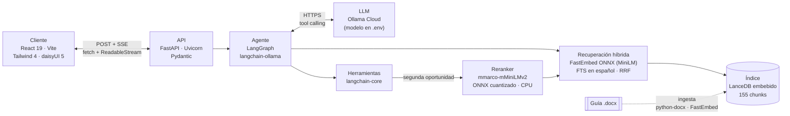

# Gianna · Asesora de inversiones de Invest Lavalleja

Chat de inversiones con **RAG y agente**: Gianna orienta a inversores y emprendedores que evalúan instalar un proyecto en el departamento de Lavalleja (Uruguay), a partir de la *Guía de Inversiones 2026*. Corre 100 % en CPU (~720 MB de RAM sin contar el reranker), guarda el conocimiento en LanceDB embebido (sin servidor) y usa Ollama Cloud para el modelo.

## Qué hace

- **Asesora, no solo responde:** arma el perfil del inversor durante la charla, recomienda una opción principal con su porqué y propone el siguiente paso.
- **Profundiza a demanda:** ante "contame más" consulta de nuevo la guía y arma un plan (cómo entrar, cómo validar, condiciones, cuándo no avanzar, próximos pasos).
- **Usa herramientas:** ficha completa de una oportunidad o zona, filtros por zona y nivel, comparación de opciones, contactos institucionales y un simulador de equilibrio con los supuestos del usuario.
- **Tiene una segunda oportunidad de búsqueda:** si la primera recuperación no responde bien, el modelo puede pedir un reranker multilingüe liviano (CPU) que reordena los candidatos y trae el fragmento que realmente contesta la pregunta.
- **Cuida los hechos:** cita las fuentes de la guía `[S##]`, no promete rentabilidad ni permisos y deriva a los organismos competentes.

## Cómo funciona



1. **Ingesta:** el `.docx` se convierte en fragmentos con su ruta de títulos, se calculan los embeddings y se genera un catálogo de zonas y oportunidades. Los anexos internos se excluyen.
2. **Consulta:** un paso de planificación deduce la intención y el perfil, y precarga el contexto relevante junto con una señal de confianza.
3. **Agente:** el modelo decide si responde directo o consulta herramientas (hasta 4 rondas) y responde en *streaming*. Si el contexto inicial es débil o `buscar_guia` no alcanza, puede llamar a `buscar_guia_reranker`, que reordena ~24 candidatos con un cross-encoder antes de responder.

## Tecnologías

FastAPI · LangGraph · Ollama Cloud · LanceDB · FastEmbed (ONNX) · Reranker `mmarco-mMiniLMv2` (ONNX, CPU) · React · Vite · Tailwind 4 · daisyUI 5.

## Inicio rápido

```bash
git clone https://github.com/NebyX1/invest-lavalleja-rag-chat.git
cd invest-lavalleja-rag-chat
cp .env.example .env          # completá OLLAMA_API_KEY
# copiá el .docx de la guía en rag-data/
.\setup.ps1                   # Linux/macOS: ./setup.sh
.\start.ps1                   # Linux/macOS: ./start.sh  → http://localhost:8010
```

Detalles y solución de problemas en [Setup.md](Setup.md).

## Documentación

- [Setup.md](Setup.md): instalación, variables de entorno y tareas habituales.
- [Arquitectura.md](Arquitectura.md): diagramas, flujos, agente, herramientas, seguridad y decisiones de diseño.
- [Admin-y-Coolify.md](Admin-y-Coolify.md): panel con doble factor, gestión de conocimiento, archivo JSONL y despliegue Docker/Coolify.

## Aviso

Gianna orienta con información de la guía; no constituye asesoramiento financiero, legal ni una habilitación. Los datos normativos y de contacto deben confirmarse antes de decidir. Las fichas de oportunidad son conceptos a validar, no ofertas de activos.
